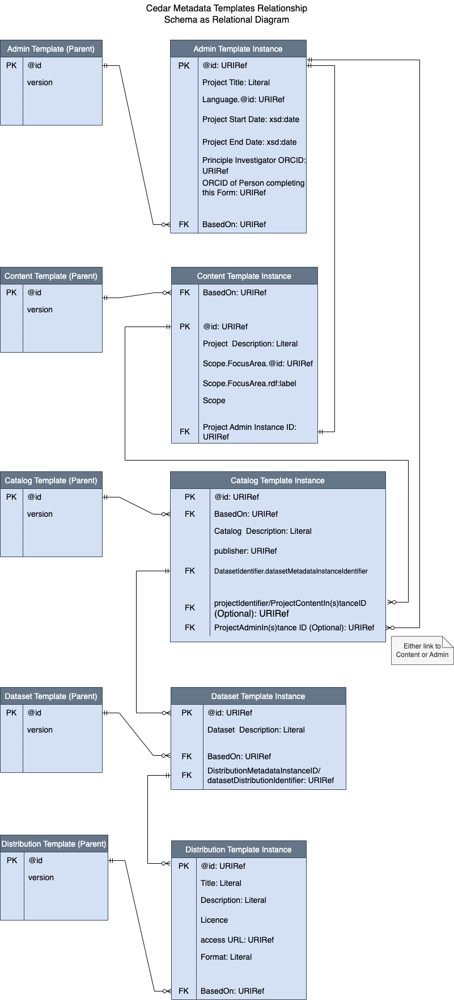
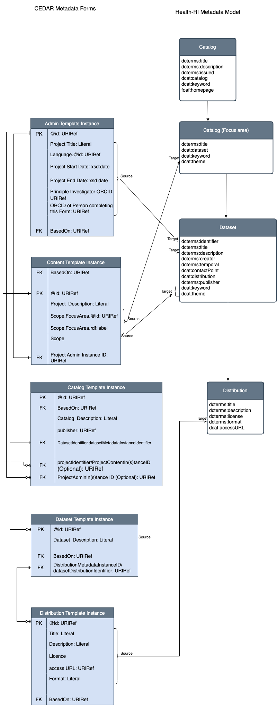

# BYCovid Export

### Version

### v0.1.0

### Summary

Current script was developed to export COVID-19 projects metadata from CEDAR metadata forms to European COVID-19 platform.
Project metadata are transformed into Health-RI developed metadata model and serialised as .ttl and/or .xml file.

### Source

#### CEDAR Templates

Metadata forms filled in based on metadata templates designed by [the Center for Expanded Data Annotation and Retrieval (CEDAR)](https://metadatacenter.org)
are the main source. CEDAR Templates hierarchy is shown in the diagram below:



#### ORCID records

[ORCID](https://orcid.org) records we used to provide creator and contact point information.

#### COVID-19 Portal

[COVID-19 NL Portal](https://covid19initiatives.health-ri.nl/p/ProjectOverview) is a homepage reference for the portal data and portal Project IDs are used as subject URLs for datasets.

### Mapping

A detailed mapping between source fields and catalog's/dataset's attributes is represented in the table below:

| Type                      | Health-RI Class | Health-ri Property URI          | Required    | Source field                                                                                                                                                                                                                                                                                                                                                                                                                                                                                                         | Transformation rule/Comment                                                                                                                                                                                                                                                                                                                                                                                                                                                                               |
|---------------------------|-----------------|---------------------------------|-------------|----------------------------------------------------------------------------------------------------------------------------------------------------------------------------------------------------------------------------------------------------------------------------------------------------------------------------------------------------------------------------------------------------------------------------------------------------------------------------------------------------------------------|-----------------------------------------------------------------------------------------------------------------------------------------------------------------------------------------------------------------------------------------------------------------------------------------------------------------------------------------------------------------------------------------------------------------------------------------------------------------------------------------------------------|
| Top-level catalog, portal | Catalog         | rdf:type                        | mandatory   |                                                                                                                                                                                                                                                                                                                                                                                                                                                                                                                      | `<Portal Base Link>`/`p/ProjectOverview` where `<Portal Base Link>` is a base URL from configuration file as `dcat:Catalog`                                                                                                                                                                                                                                                                                                                                                                               |
|                           |                 | dcterms:title                   | mandatory   |                                                                                                                                                                                                                                                                                                                                                                                                                                                                                                                      | Hardcoded to `COVID-19 related data initiatives - Project overview`                                                                                                                                                                                                                                                                                                                                                                                                                                       |
|                           |                 | dcterms:description             | mandatory   |                                                                                                                                                                                                                                                                                                                                                                                                                                                                                                                      | Hardcoded to ```Health-RI launched the Dutch COVID-19 Data Support Programme to support investigators and health care professionals with tools and services in their search for ways to overcome the pandemic and its' health consequences. To facilitate and stimulate an integrated health data infrastructure, Health-RI facilitates investigators by connecting communities, providing data services and tools, and presenting an overview of COVID-19 related initiatives, provided on this site.``` |
|                           |                 | dcterms:issued                  | mandatory   |                                                                                                                                                                                                                                                                                                                                                                                                                                                                                                                      | Export date in `xsd:date` format                                                                                                                                                                                                                                                                                                                                                                                                                                                                          |
|                           |                 | dcat:catalog                    |             | `Cedar`.`Content Template Instance`.`Scope`.`Focus Area`.`Focus Area`.`@id`                                                                                                                                                                                                                                                                                                                                                                                                                                          | `<Portal Base Link>`/`p/ProjectOverview?focusarea=<Source field focus area id>`                                                                                                                                                                                                                                                                                                                                                                                                                           |
|                           |                 | dcat:keyword                    |             |                                                                                                                                                                                                                                                                                                                                                                                                                                                                                                                      | Hardcoded to `COVID-19`                                                                                                                                                                                                                                                                                                                                                                                                                                                                                   |
|                           |                 | foaf:homepage                   | mandatory   |                                                                                                                                                                                                                                                                                                                                                                                                                                                                                                                      | `<Portal Base Link>`/`p/ProjectOverview`                                                                                                                                                                                                                                                                                                                                                                                                                                                                  |                                                                                                                                                                                                                                                                                                                                                                                                                                                                                                             |
| Focus area level          | Catalog         | rdf:type                        | mandatory   | `Cedar`.`Content Template Instance`.`Scope`.`Focus Area`.`Focus Area`.`@id`                                                                                                                                                                                                                                                                                                                                                                                                                                          | `<Portal Base Link>`.`p/ProjectOverview?focusarea=``<Source field focus area id>` as `dcat:Catalog`                                                                                                                                                                                                                                                                                                                                                                                                       |
|                           |                 | dcterms:title                   | mandatory   | `Cedar`.`Content Template Instance`.`Scope`.`Focus Area`.`Focus Area`.`rdf:label`                                                                                                                                                                                                                                                                                                                                                                                                                                    |                                                                                                                                                                                                                                                                                                                                                                                                                                                                                                           |
|                           |                 | dcat:dataset                    |             | Portal Project URL                                                                                                                                                                                                                                                                                                                                                                                                                                                                                                   | Fetch `Project ID` from portal by `Cedar`.`Content Template Instance`.`Scope`.`Project Admin Instance ID`, set to `<Portal Base Link>`/`p/Project`/`<Poject ID>`                                                                                                                                                                                                                                                                                                                                          |
|                           |                 | dcat:theme                      | mandatory   | `Cedar`.`Content Template Instance`.`Scope`.`Focus Area`.`Focus Area`.`@id`                                                                                                                                                                                                                                                                                                                                                                                                                                          |                                                                                                                                                                                                                                                                                                                                                                                                                                                                                                           |
| Project level             | Dataset         | rdf:type                        | mandatory   | Portal Project URL                                                                                                                                                                                                                                                                                                                                                                                                                                                                                                   | Fetch Project `UniqueId` from portal by `Cedar`.`Admin Template Instance`.`@id` as `dcat:Dataset`; if several datasets belong to the project `<Portal Project URL>`#`<dataset number (autoincrement)>`                                                                                                                                                                                                                                                                                                    |
|                           |                 | dcterms:identifier              |             | Portal Project `UniqueId`                                                                                                                                                                                                                                                                                                                                                                                                                                                                                            | Project `UniqueId` as type `xsd:token`                                                                                                                                                                                                                                                                                                                                                                                                                                                                    |
|                           |                 | dcterms:description             | mandatory   | `Cedar`.`Catalog Template Instance`.`catalogDescription` or `Cedar`.`Content Template Instance`.`Project Title`                                                                                                                                                                                                                                                                                                                                                                                                      | If Dataset Description is empty join all Project Titles from Content Template Instance                                                                                                                                                                                                                                                                                                                                                                                                                    |
|                           |                 | dcterms:title                   | mandatory   | `Cedar`.`Admin Template Instance`.`Project Information`.`Project Names1`.`Project Title1`.`Project Title`.`@value` and `Cedar`.`Admin Template Instance`.`Project Information`.`Project Names1`.`Project Title1`.`Language`.`@id`                                                                                                                                                                                                                                                                                    | `<Project Title>`@`<split Language.@id by '/' and take last>`                                                                                                                                                                                                                                                                                                                                                                                                                                             |                                                                                                                                                                                                                                                                                                                                                                                                                                                                                                          |
|                           |                 | dcterms:temporal.rdf:type       | mandatory   |                                                                                                                                                                                                                                                                                                                                                                                                                                                                                                                      | `dcterms:PeriodOfTime`                                                                                                                                                                                                                                                                                                                                                                                                                                                                                    |
|                           |                 | dcterms:temporal.dcat:startDate |             | `Cedar`.`Admin Template Instance`.`Funder Information`.`Project Dates`.`(Expected) Start Date of Project`.`@value`                                                                                                                                                                                                                                                                                                                                                                                                   |                                                                                                                                                                                                                                                                                                                                                                                                                                                                                                           |
|                           |                 | dcterms:temporal.dcat:endDate   |             | `Cedar`.`Admin Template Instance`.`Funder Information`.`Project Dates`.`(Expected) End Date of Project`.`@value`                                                                                                                                                                                                                                                                                                                                                                                                     |                                                                                                                                                                                                                                                                                                                                                                                                                                                                                                           |
|                           |                 | dcterms:creator.rdf:type        | mandatory   |                                                                                                                                                                                                                                                                                                                                                                                                                                                                                                                      | `v:VCard` or `dcterms:creator`: set to `v:VCard` node in the export as per ByCovid request. To enable that `userinfo_format` parameter passed to [DCATDataSet.to_graph()](../models/bycovid_models.py#L52) is set to `VCARD.VCard`; default value for that parameter is `None` which results in `dcterms:creator` as `rdf:type` and `Cedar`.`Admin Template Instance`.`ORCID of Person completing this Form` as value                                                                                     |
|                           |                 | dcterms:creator.v:fn            |             | `ORCID API`.`ORCID record`.`person`.`name`                                                                                                                                                                                                                                                                                                                                                                                                                                                                           | `ORCID record`.`person`.`name`.`given-names`.`value`  `ORCID record`.`person`.`name`.`family-name`.`value`                                                                                                                                                                                                                                                                                                                                                                                                |
|                           |                 | dcterms:creator.v:hasUID        |             | `Cedar`.`Admin Template Instance`.`ORCID of Person completing this Form`                                                                                                                                                                                                                                                                                                                                                                                                                                             |                                                                                                                                                                                                                                                                                                                                                                                                                                                                                                           |
|                           |                 | dcat:contactPoint.rdf:type      | mandatory   |                                                                                                                                                                                                                                                                                                                                                                                                                                                                                                                      | `v:VCard` or `dcterms:creator`: set to `v:VCard` node in the export as per ByCovid request. To enable that `userinfo_format` parameter passed to [DCATDataSet.to_graph()](../models/bycovid_models.py#L52) is set to `VCARD.VCard`; default value for that parameter is `None` which results in `dcterms:creator` as `rdf:type` and `Cedar`.`Admin Template Instance`.`Principle Investigator ORCID` as value                                                                                             |
|                           |                 | dcat:contactPoint.v:fn          | optional    | `ORCID API`.`ORCID record`.`person`.`name`                                                                                                                                                                                                                                                                                                                                                                                                                                                                           | `ORCID record`.`person`.`name`.`given-names`.`value`  `ORCID record`.`person`.`name`.`family-name`.`value`                                                                                                                                                                                                                                                                                                                                                                                                |
|                           |                 | dcat:contactPoint.v:hasUID      | conditional | `Cedar`.`Admin Template Instance`.`Principle Investigator ORCID`                                                                                                                                                                                                                                                                                                                                                                                                                                                     |                                                                                                                                                                                                                                                                                                                                                                                                                                                                                                           |
|                           |                 | dcat:distribution               |             | `Cedar`.`Dataset Template Instance`.`DistributionMetadataInstanceID` or `Cedar`.`Dataset Template Instance`.`datasetDistributionIdentifier` to link Dataset Template Instance and Distribution `Cedar`.`Catalog Template Instance`.`datasetIdentifier` to link Catalog Template Instance and Datasets, `Cedar`.`Catalog Template Instance`.`projectIdentifier/ProjectContentIn(s)tanceID` or `Cedar`.`Catalog Template Instance`.`ProjectAdminIn(s)tance ID` to link Catalog and Content or Admin Template Instances | `<Portal Project URL>`#`distribution` or `<Portal Project URL>`#`<dataset number (autoincrement)>`-`distribution`; if more than one distributions per project available add `-<autoincrement distribution number>` at the end                                                                                                                                                                                                                                                                             |
|                           |                 | dcterms:publisher               | optional    | `Cedar`.`Catalog Template Instance`.`publisher`.`@id`                                                                                                                                                                                                                                                                                                                                                                                                                                                                |                                                                                                                                                                                                                                                                                                                                                                                                                                                                                                           |
|                           |                 | dcat:keyword                    |             | `Cedar`.`Content Template Instance`.`Scope`                                                                                                                                                                                                                                                                                                                                                                                                                                                                          | Walk over tree under `Scope` and add `rdfs:label` of `@value` for each property (`Area Level`, `Care Setting`, `Temporal Scope`, `Population Group`, `Disease`, `Focus Area`.`Other Focus Area`) as keywords                                                                                                                                                                                                                                                                                              |                                                                                                                                                                                                                                                                                                                                                                                                                                                                                                          |
|                           |                 | dcat:theme                      | mandatory   | `Cedar`.`Content Template Instance`.`Scope`                                                                                                                                                                                                                                                                                                                                                                                                                                                                          | Walk over tree under `Scope` and add `@id` for each property (`Area Level`, `Care Setting`, `Temporal Scope`, `Population Group`, `Disease`) as theme                                                                                                                                                                                                                                                                                                                                                     |
| Distribution level        | Distribution    | rdf:type                        | mandatory   | `Cedar`.`Dataset Template Instance`.`DistributionMetadataInstanceID` or `Cedar`.`Dataset Template Instance`.`datasetDistributionIdentifier` to link Dataset Template Instance and Distribution `Cedar`.`Catalog Template Instance`.`datasetIdentifier` to link Catalog Template Instance and Datasets, `Cedar`.`Catalog Template Instance`.`projectIdentifier/ProjectContentIn(s)tanceID` or `Cedar`.`Catalog Template Instance`.`ProjectAdminIn(s)tance ID` to link Catalog and Content or Admin Template Instances | `<Portal Project URL>`#`distribution` or `<Portal Project URL>`#`<dataset number (autoincrement)>`-`distribution`; if more than one distributions per project available add `-<autoincrement distribution number>` at the end                                                                                                                                                                                                                                                                             |
|                           |                 | dcterms:title                   |             | `Cedar`.`Distribution Template Instance`.`title`.`@value`                                                                                                                                                                                                                                                                                                                                                                                                                                                            |                                                                                                                                                                                                                                                                                                                                                                                                                                                                                                           |
|                           |                 | dcterms:description             |             | `Cedar`.`Distribution Template Instance`.`description`.`@value`                                                                                                                                                                                                                                                                                                                                                                                                                                                      |                                                                                                                                                                                                                                                                                                                                                                                                                                                                                                           |
|                           |                 | dcterms:license                 |             | `Cedar`.`Distribution Template Instance`.`license`.`@value`                                                                                                                                                                                                                                                                                                                                                                                                                                                          |                                                                                                                                                                                                                                                                                                                                                                                                                                                                                                           |
|                           |                 | dcat:accessURL                  |             | `Cedar`.`Distribution Template Instance`.`accessURL`.`@id`                                                                                                                                                                                                                                                                                                                                                                                                                                                           |                                                                                                                                                                                                                                                                                                                                                                                                                                                                                                           |
|                           |                 | dcterms:format                  |             | `Cedar`.`Distribution Template Instance`.`distributionFormat`.`@value`                                                                                                                                                                                                                                                                                                                                                                                                                                               |                                                                                                                                                                                                                                                                                                                                                                                                                                                                                                           |

A schematic representation of CEDAR source to target mapping:



### Repository structure, configuration and running the code

[cedar/client.py](../cedar/client.py) - API client for CEDAR

[covid_portal/covid_portal_client.py](../covid_portal/covid_portal_client.py) - API client for COVID-19 portal

[orcid/orcid_client.py](../orcid/orcid_client.py) - API client for ORCID

[dcat_exports/dcat_bycovid_export.py](dcat_bycovid_export.py) - export main

[dcat_exports/export_controller.py](export_controller.py) - methods to extract, merge and validate source data

[dcat_exports/export_utils.py](export_utils.py) - utility data export functions

[dcat_exports/cedar_source_data.py](cedar_source_data.py) - methods to extract data from Admin templates

[models/bycovid_models.py](../models/bycovid_models.py) - pydantic models describing dataset attributes and defining methods to convert metadata to a graph

[./example-output](../example-output) - a default output directory for expected test files and export output files


Export configuration should be provided as `config.yml` file places in the repository root directory and contain the following:
- Required: API token for CEDAR
- Required: API token for ORCID
- Required: Username, password and base URL for COVID-19 portal
- Optional: API query limit for CEDAR portal with 500 as maximum. If not provided 100 is a default

For example:
```yaml
cedar:
  apikey: "123abc1a2c3c_my_cedar_api_token"
  limit: 500

orcid:
  token: "123abc1a2c3c_my_orcid_api_token"

covid_portal:
  username: "My_User_Name"
  password: "my secret password"
  base_url: "https://covid19initiatives.health-ri.nl"
```

### Changelog

### v0.1.0

Initial version
